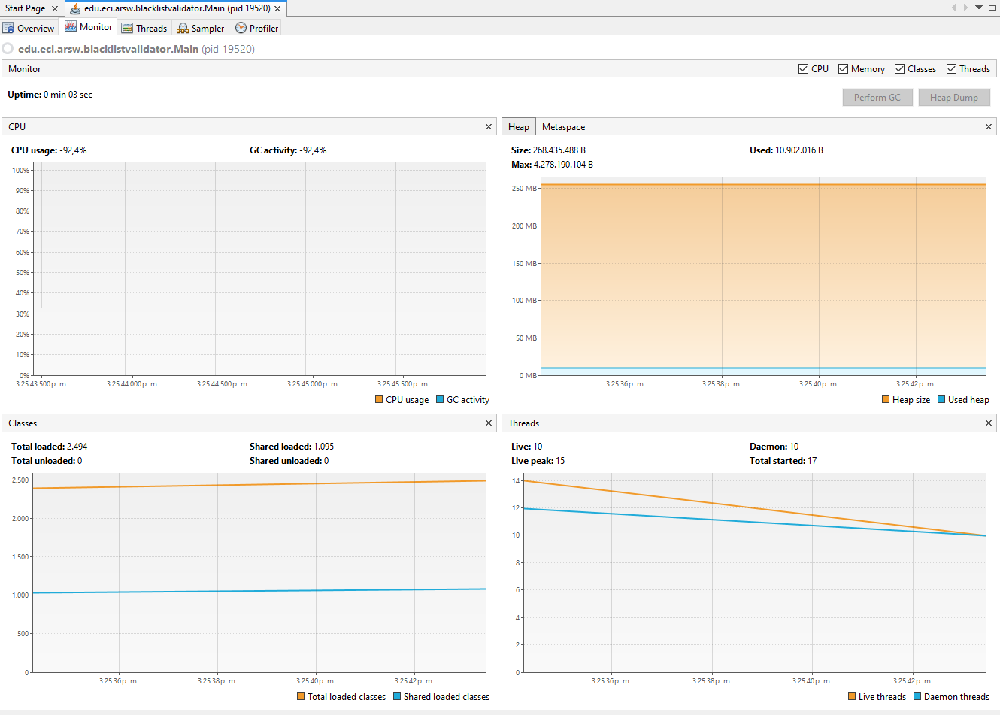
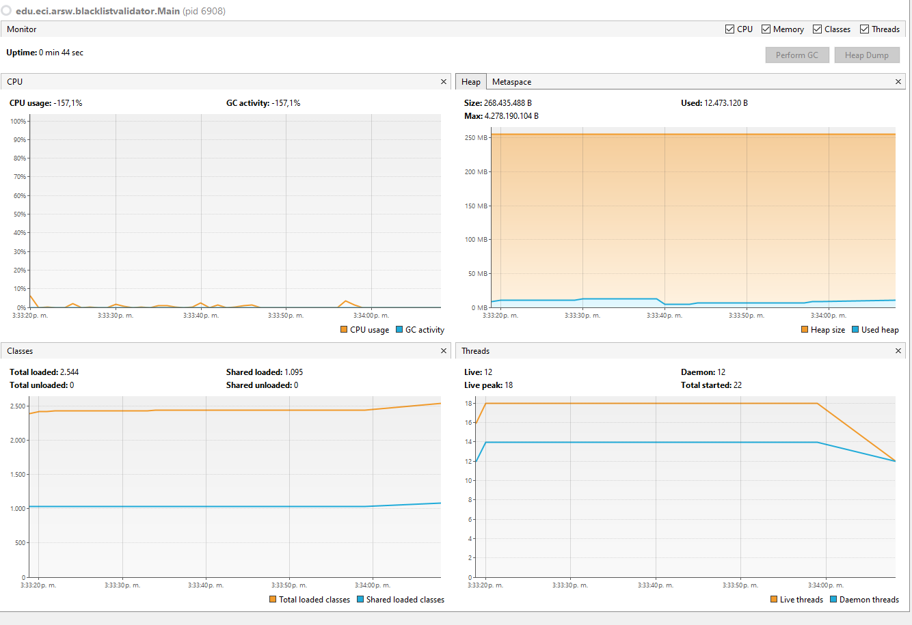
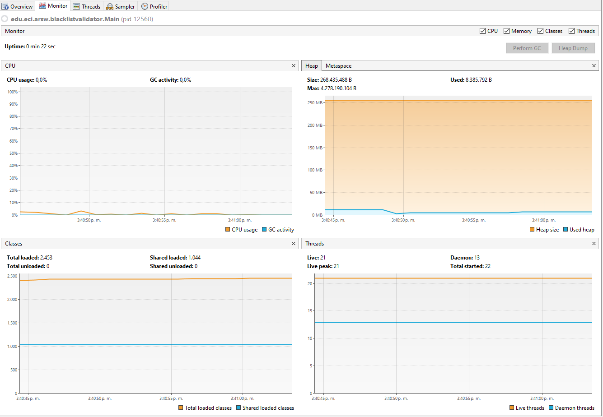
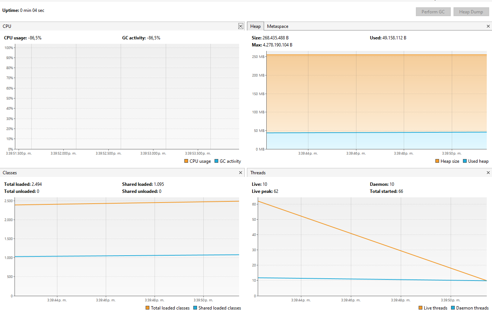
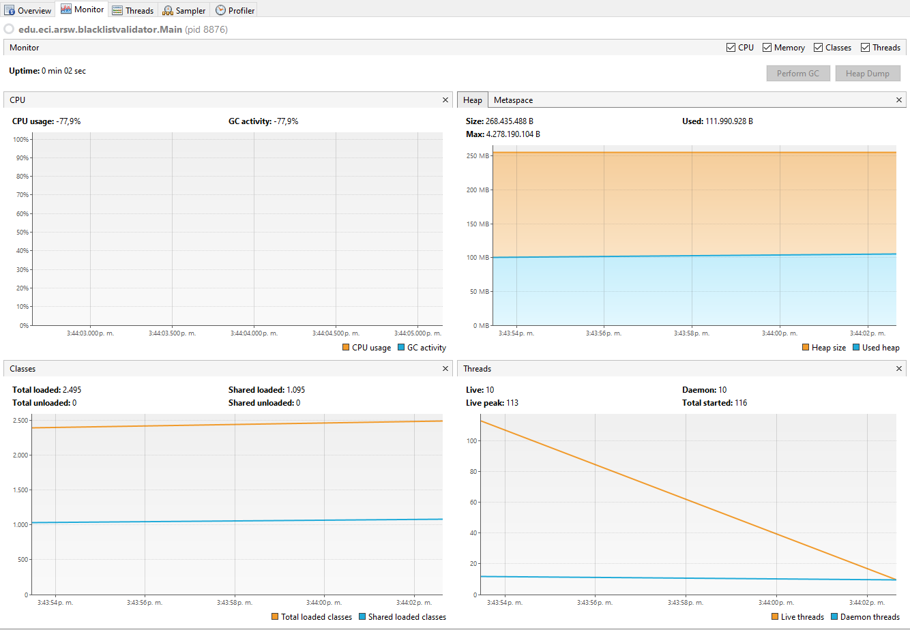
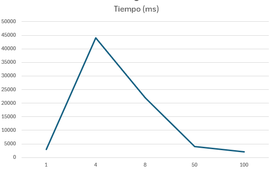

# ARSW_LAB1
 Java threads parelelism
 
 ### Descripción
  Este ejercicio contiene una introducción a la programación con hilos en Java, además de la aplicación a un caso concreto.
  

**Parte I - Introducción a Hilos en Java**

1. Se implementa la clase `CountThread` que extiende de la clase `Thread`, la cual recibe como parámetros de construcción dos enteros **numeroA** y **numeroB** que definen el rango de iteración. Esta clase implementa el método `count()` que realiza la impresión secuencial de los valores comprendidos en el intervalo [numeroA, numeroB], y sobrescribe el método `run()` heredado de `Thread` para invocar la funcionalidad de conteo durante la ejecución del hilo.

    

2. Creamos la clase `CountThreadMain` la cual nos permitira instanciar 3 hilos de la clase **CountThread** y observar la ejecucion de estos

    1. Se instancian tres objetos `CountThread` con rangos de iteración particionados y no solapados:
       - **Hilo t1**: Intervalo [0, 99] - procesa 100 elementos (0 a 99 inclusive)
       - **Hilo t2**: Intervalo [99, 199] - procesa 101 elementos (99 a 199 inclusive)  
       - **Hilo t3**: Intervalo [200, 299] - procesa 100 elementos (200 a 299 inclusive)
    
      Esto nos permite dividir el trabajo de contar 300 números entre los 3 hilos, donde cada uno se encarga de una parte diferente, ejecutándose todos al mismo tiempo.

    

    2. Iniciamos la ejecución de los hilos con el método `start()`, en el cual podemos observar que cada hilo ejecuta en paralelo su conteo.

        
    
    3. ¿Qué sucedería si usamos el método **run()** en vez del método **start()**?

        
    
        Como podemos observar, el método `run()` ejecuta cada hilo secuencialmente. Esto sucede porque cuando llamamos directamente a `run()`, no se crean nuevos hilos, sino que el código se ejecuta en el hilo principal. Por lo tanto, cada "hilo" espera a que el anterior termine completamente antes de comenzar, comportándose como métodos normales en lugar de hilos reales.
    
        La diferencia clave es:
        - **`start()`**: Crea hilos reales que ejecutan al mismo tiempo
        - **`run()`**: Ejecuta el código uno tras otro en el hilo principal

**Parte II - Ejercicio Black List Search**

### Contexto y Descripción del Problema

En el desarrollo de un software de vigilancia automática de seguridad informática, es necesario validar direcciones IP contra varios miles de listas negras (blacklists) que contienen hosts maliciosos conocidos. El objetivo es identificar y reportar aquellas direcciones IP que aparezcan en al menos cinco de estas listas, considerándolas como no confiables.

Para optimizar el proceso de búsqueda, se propone paralelizar la tarea utilizando múltiples hilos. Cada hilo será responsable de revisar una parte específica del total de listas negras, permitiendo así que la validación se realice de manera más eficiente y rápida.

1. Creacion de la clase `ThreadConsult` la cual realizará una consulta en un rango del conjunto de las listas negras

    

2. Modificación del método `checkHost` para la utilización de la clase hilo cumpliendo los requisitos

- Recibir como parámetro el número de hilos a usar.
- Dividir el espacio de búsqueda entre los N hilos.
- Iniciar todos los hilos y esperar a que terminen (usando `join`).
- Sumar los resultados de todos los hilos y decidir si la IP es confiable o no, según la cantidad de ocurrencias encontradas.
- Mantener el log que informa cuántas listas negras se revisaron, garantizando que la información sea verídica bajo el esquema paralelo.

 

 3. Prueba de la implementación

- 200.24.24.55

 

 - 200.24.34.55

**Parte III - Evaluación de Desempeño**

# Resultados de Ejecución con Diferentes Cantidades de Hilos

Se ejecutó el programa con distintos niveles de concurrencia para analizar el impacto en el tiempo de ejecución, el uso de CPU, memoria y threads.

## ⏱️ Tiempos de ejecución

| Hilos | Tiempo |
|-------|---------|
| 1     | **3 s** |
| 4     | **44 s** |
| 8     | **22 s** |
| 50    | **4 s** |
| 100   | **2 s** |

---

## Análisis por casos

### 🔹 1 hilo (3s)
- Ejecución secuencial rápida.  
- La CPU se mantiene estable y con baja carga.  
- No hay overhead de sincronización.  

---

### 🔹 4 hilos (44s)
- El peor caso: el tiempo aumenta drásticamente.  
- Evidencia de **sobrecarga por sincronización** o espera activa.  
- Los hilos se bloquean entre sí en lugar de trabajar en paralelo.  

---

### 🔹 8 hilos (22s)
- Mejor que 4 hilos, pero aún más lento que 1 hilo.  
- Persisten bloqueos y overhead de coordinación.  

---

### 🔹 50 hilos (4s)
- El rendimiento mejora notablemente.  
- La carga se distribuye mejor y siempre hay hilos disponibles.  
- Uso de CPU más alto y eficiente.  

---

### 🔹 100 hilos (2s)
- El mejor tiempo de ejecución.  
- Alto aprovechamiento de CPU.  
- El heap usado se mantiene bajo, sin problemas de memoria.  

---

### 🔹 Grafico Hilos/Tiempos(ms)

## Conclusiones
1. Con pocos hilos (4 y 8) el rendimiento empeora debido a **bloqueos y sincronización ineficiente**.  
2. Con muchos hilos (50 y 100) la espera se diluye y el paralelismo se aprovecha mejor, reduciendo el tiempo.  
3. El **óptimo en esta máquina fue con 100 hilos (2s)**, pero este número puede variar según la cantidad de núcleos del procesador.

**Parte IV - Ejercicio Black List Search**

### Análisis de desempeño y Ley de Amdahl

#### 1. ¿Por qué el mejor desempeño no se logra con los 500 hilos? ¿Cómo se compara este desempeño cuando se usan 200?

Aunque la Ley de Amdahl predice que aumentar el número de hilos debería mejorar el desempeño teórico, en la práctica esto no ocurre indefinidamente. Al usar 500 hilos, el sistema operativo y la JVM deben administrar muchos más hilos de los que realmente pueden ejecutarse en paralelo, lo que genera sobrecarga, mayor consumo de memoria y posible competencia por recursos. Por eso, el desempeño podría empeorar con 500 hilos.

Por ejemplo, en las pruebas realizadas:
- Con 1 hilo el tiempo fue de **3 segundos**.
- Con 50 hilos el tiempo fue de **4 segundos**.
- Con 100 hilos el tiempo fue de **2 segundos**.
- Con 200 hilos (hipotético, ya que no se probó exactamente, pero se esperaría un comportamiento similar o peor que con 100).
- Con 500 hilos (hipotético), el tiempo podría aumentar debido a la sobrecarga.

Esto muestra que, aunque más hilos pueden ayudar hasta cierto punto, después de un límite el rendimiento empeora.

#### 2. ¿Cómo se comporta la solución usando tantos hilos de procesamiento como núcleos comparado con el resultado de usar el doble de éste?

Usar tantos hilos como núcleos suele ser lo más eficiente, ya que cada hilo puede ejecutarse en un núcleo físico sin esperar. Si se usan el doble de hilos, puede haber una ligera mejora si hay operaciones bloqueantes, pero normalmente se genera más sobrecarga y el rendimiento no mejora, e incluso puede empeorar debido al mayor cambio de contexto y competencia por recursos.

**Ejemplo:**
- Si tu máquina tiene 4 núcleos:
  - Con 4 hilos el tiempo fue de **44 segundos**.
  - Con 8 hilos el tiempo fue de **22 segundos**.
  - Sin embargo, con 50 o 100 hilos el tiempo fue menor, lo que indica que el problema es altamente paralelizable y la sobrecarga de hilos no supera los beneficios en este caso específico.

#### 3. Si para este problema en lugar de 100 hilos en una sola CPU se pudiera usar 1 hilo en cada una de 100 máquinas hipotéticas, ¿la ley de Amdahl se aplicaría mejor? Si en lugar de esto se usaran c hilos en 100/c máquinas distribuidas (siendo c el número de núcleos de dichas máquinas), ¿se mejoraría? Explique su respuesta.

Sí, la ley de Amdahl se aplicaría mejor si el trabajo se distribuye entre varias máquinas, ya que cada una puede trabajar en paralelo real, sin compartir recursos físicos. Si se usan c hilos en 100/c máquinas, se aprovechan todos los núcleos disponibles y se reduce la sobrecarga de administración de hilos en una sola máquina, mejorando el rendimiento global. Sin embargo, habría que considerar la sobrecarga de comunicación entre máquinas si existiera.

**Ejemplo:**
- Si tienes 100 tareas y 1 CPU con 100 hilos, hay competencia por recursos y sobrecarga.
- Si tienes 100 máquinas y 1 hilo por máquina, cada tarea se ejecuta realmente en paralelo, logrando el máximo beneficio teórico según la ley de Amdahl.
- Si tienes 10 máquinas de 10 núcleos cada una y usas 10 hilos por máquina, también se aprovecha el paralelismo, pero la eficiencia dependerá de la distribución y la comunicación

