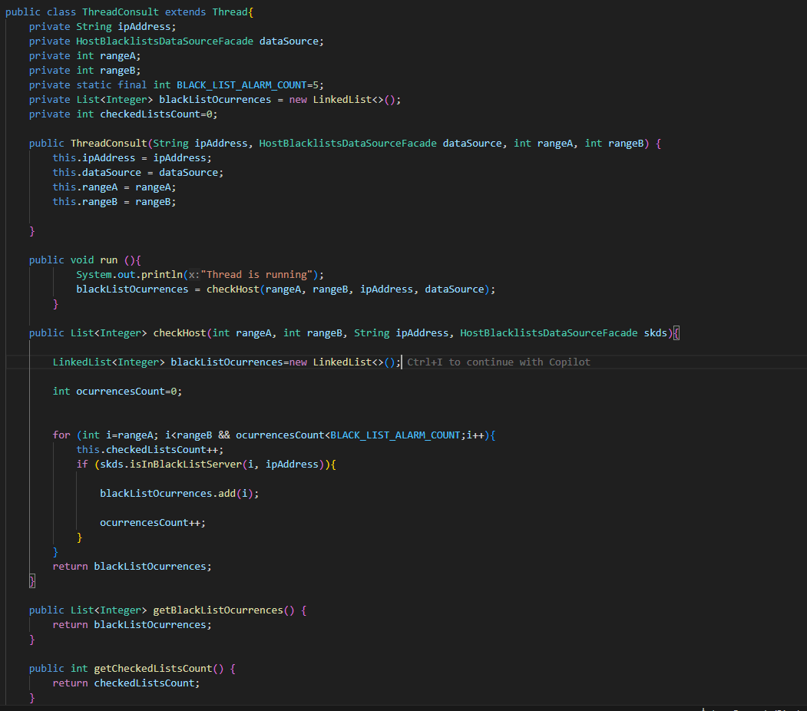
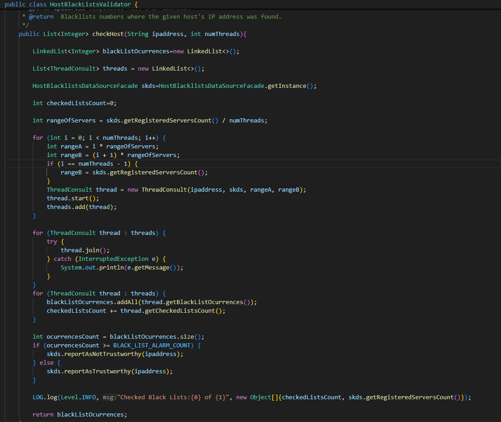
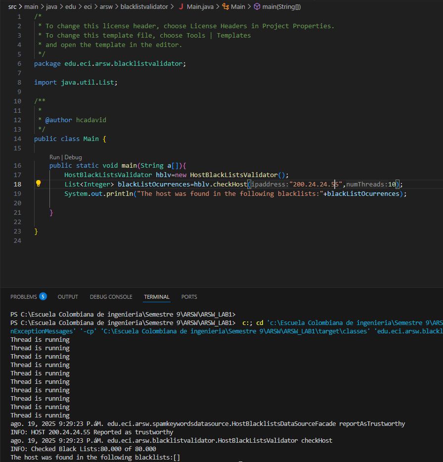
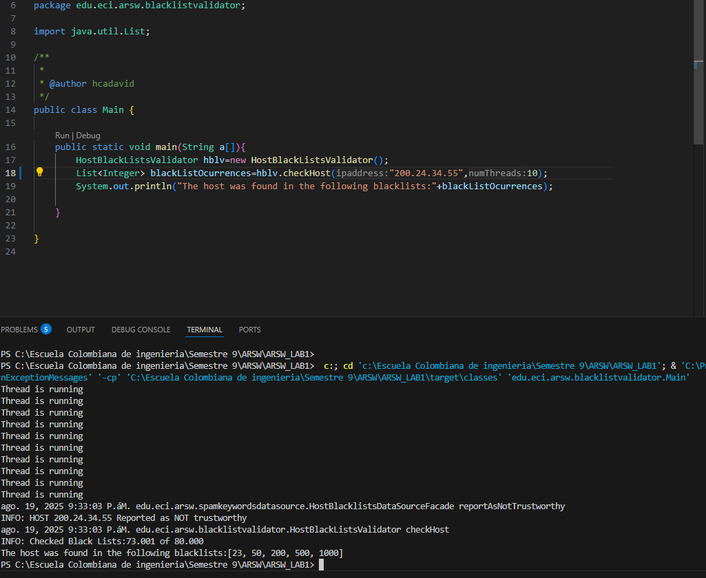

# ARSW_LAB1
 Java threads parelelism
 
 ### Descripción
  Este ejercicio contiene una introducción a la programación con hilos en Java, además de la aplicación a un caso concreto.
  

**Parte I - Introducción a Hilos en Java**

1. Se implementa la clase `CountThread` que extiende de la clase `Thread`, la cual recibe como parámetros de construcción dos enteros **numeroA** y **numeroB** que definen el rango de iteración. Esta clase implementa el método `count()` que realiza la impresión secuencial de los valores comprendidos en el intervalo [numeroA, numeroB], y sobrescribe el método `run()` heredado de `Thread` para invocar la funcionalidad de conteo durante la ejecución del hilo.

    

2. Creamos la clase `CountThreadMain` la cual nos permitira instanciar 3 hilos de la clase **CountThread** y observar la ejecucion de estos

    1. Se instancian tres objetos `CountThread` con rangos de iteración particionados y no solapados:
       - **Hilo t1**: Intervalo [0, 99] - procesa 100 elementos (0 a 99 inclusive)
       - **Hilo t2**: Intervalo [99, 199] - procesa 101 elementos (99 a 199 inclusive)  
       - **Hilo t3**: Intervalo [200, 299] - procesa 100 elementos (200 a 299 inclusive)
    
      Esto nos permite dividir el trabajo de contar 300 números entre los 3 hilos, donde cada uno se encarga de una parte diferente, ejecutándose todos al mismo tiempo.

    

    2. Iniciamos la ejecución de los hilos con el método `start()`, en el cual podemos observar que cada hilo ejecuta en paralelo su conteo.

        
    
    3. ¿Qué sucedería si usamos el método **run()** en vez del método **start()**?

        
    
        Como podemos observar, el método `run()` ejecuta cada hilo secuencialmente. Esto sucede porque cuando llamamos directamente a `run()`, no se crean nuevos hilos, sino que el código se ejecuta en el hilo principal. Por lo tanto, cada "hilo" espera a que el anterior termine completamente antes de comenzar, comportándose como métodos normales en lugar de hilos reales.
    
        La diferencia clave es:
        - **`start()`**: Crea hilos reales que ejecutan al mismo tiempo
        - **`run()`**: Ejecuta el código uno tras otro en el hilo principal

**Parte II - Ejercicio Black List Search**

### Contexto y Descripción del Problema

En el desarrollo de un software de vigilancia automática de seguridad informática, es necesario validar direcciones IP contra varios miles de listas negras (blacklists) que contienen hosts maliciosos conocidos. El objetivo es identificar y reportar aquellas direcciones IP que aparezcan en al menos cinco de estas listas, considerándolas como no confiables.

Para optimizar el proceso de búsqueda, se propone paralelizar la tarea utilizando múltiples hilos. Cada hilo será responsable de revisar una parte específica del total de listas negras, permitiendo así que la validación se realice de manera más eficiente y rápida.

1. Creacion de la clase `ThreadConsult` la cual realizará una consulta en un rango del conjunto de las listas negras

    

2. Modificación del método `checkHost` para la utilización de la clase hilo cumpliendo los requisitos

- Recibir como parámetro el número de hilos a usar.
- Dividir el espacio de búsqueda entre los N hilos.
- Iniciar todos los hilos y esperar a que terminen (usando `join`).
- Sumar los resultados de todos los hilos y decidir si la IP es confiable o no, según la cantidad de ocurrencias encontradas.
- Mantener el log que informa cuántas listas negras se revisaron, garantizando que la información sea verídica bajo el esquema paralelo.

 

 3. Prueba de la implementación

- 200.24.24.55

 

 - 200.24.34.55

**Parte III - Evaluación de Desempeño**

