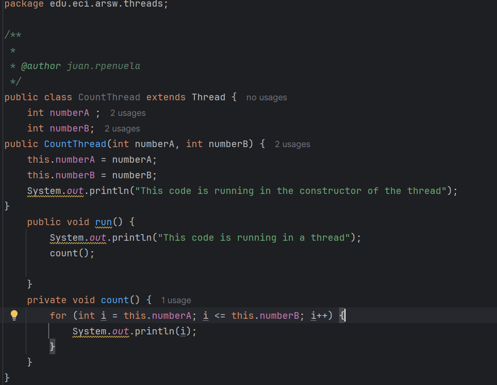
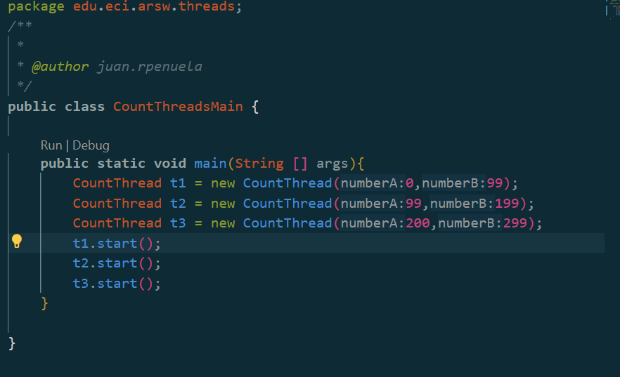
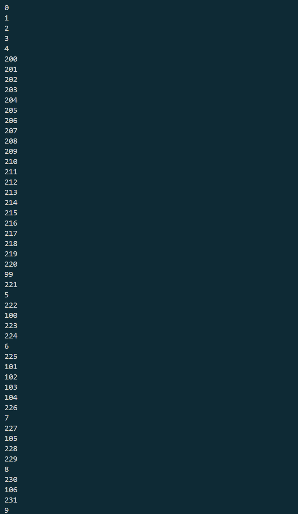
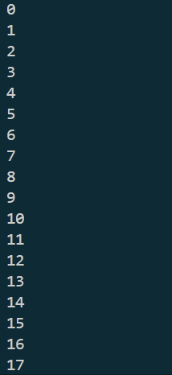

# ARSW_LAB1
 Java threads parelelism
 
 ### Descripción
  Este ejercicio contiene una introducción a la programación con hilos en Java, además de la aplicación a un caso concreto.
  

**Parte I - Introducción a Hilos en Java**

1. Se implementa la clase `CountThread` que extiende de la clase `Thread`, la cual recibe como parámetros de construcción dos enteros **numeroA** y **numeroB** que definen el rango de iteración. Esta clase implementa el método `count()` que realiza la impresión secuencial de los valores comprendidos en el intervalo [numeroA, numeroB], y sobrescribe el método `run()` heredado de `Thread` para invocar la funcionalidad de conteo durante la ejecución del hilo.

    

2. Creamos la clase `CountThreadMain` la cual nos permitira instanciar 3 hilos de la clase **CountThread** y observar la ejecucion de estos

    1. Se instancian tres objetos `CountThread` con rangos de iteración particionados y no solapados:
       - **Hilo t1**: Intervalo [0, 99] - procesa 100 elementos (0 a 99 inclusive)
       - **Hilo t2**: Intervalo [99, 199] - procesa 101 elementos (99 a 199 inclusive)  
       - **Hilo t3**: Intervalo [200, 299] - procesa 100 elementos (200 a 299 inclusive)
    
      Esto nos permite dividir el trabajo de contar 300 números entre los 3 hilos, donde cada uno se encarga de una parte diferente, ejecutándose todos al mismo tiempo.

    

    2. Iniciamos la ejecución de los hilos con el método `start()`, en el cual podemos observar que cada hilo ejecuta en paralelo su conteo.

        
    
    3. ¿Qué sucedería si usamos el método **run()** en vez del método **start()**?

        
    
        Como podemos observar, el método `run()` ejecuta cada hilo secuencialmente. Esto sucede porque cuando llamamos directamente a `run()`, no se crean nuevos hilos, sino que el código se ejecuta en el hilo principal. Por lo tanto, cada "hilo" espera a que el anterior termine completamente antes de comenzar, comportándose como métodos normales en lugar de hilos reales.
    
        La diferencia clave es:
        - **`start()`**: Crea hilos reales que ejecutan al mismo tiempo
        - **`run()`**: Ejecuta el código uno tras otro en el hilo principal

